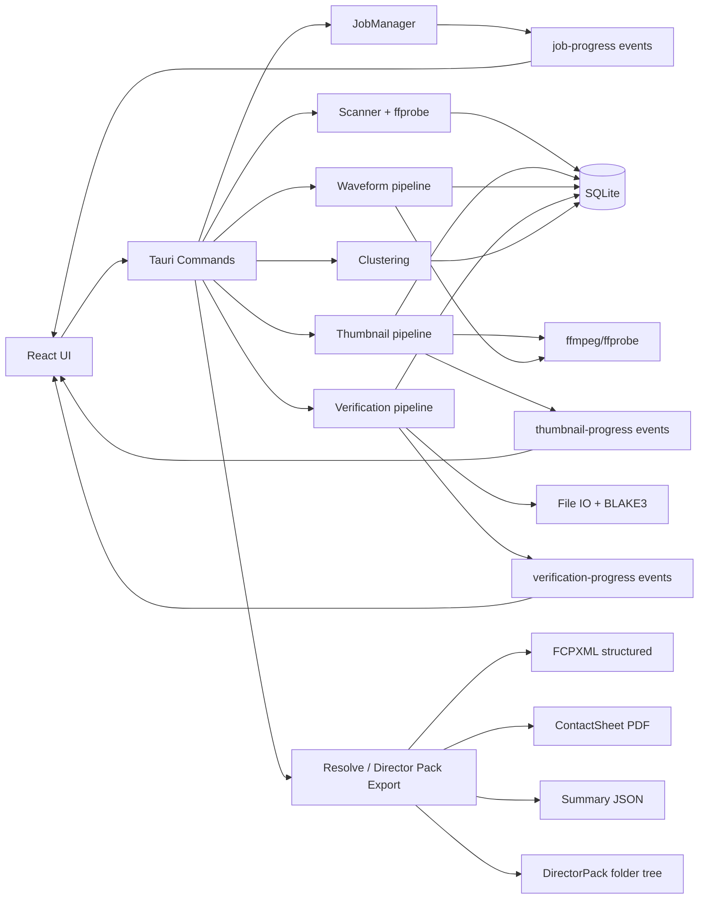

# WRAP_PREVIEW_ARCHITECTURE_STATUS

## Scope of This Phase
This phase was executed as architecture stabilization/hardening only, focused on:
- Unified job orchestration
- Filter consistency across view and export pipelines
- Resolve export structure upgrade
- Director Pack export orchestration
- Background-job safety hardening (remove `unwrap()` from background execution paths)

No unrelated feature domains were added.

## 1. Unified Job System
### What changed
A single `JobManager` now owns job lifecycle and cancellation state.

Implemented in `src-tauri/src/jobs.rs`:
- Job identity and metadata:
  - `id`
  - `kind`
  - `status`: `queued | running | done | failed | cancelled`
  - `progress` (0..1)
  - `message`
  - `error`
  - timestamps (`created_at`, `updated_at`)
- Job controls:
  - create
  - running/progress/done/failed transitions
  - cancel flag (`AtomicBool`) per job
  - get/list APIs
- Event propagation:
  - `job-progress` event emitted on state changes (via commands helper)

### New command surface
Added in `src-tauri/src/commands.rs` and registered in `src-tauri/src/lib.rs`:
- `get_job(job_id)`
- `list_jobs()`
- `cancel_job(job_id)`

### Pipeline integration
Heavy pipelines now run under JobManager tracking:
- Thumbnail extraction (`extract_thumbnails`) -> `kind=thumbnails`
- Waveform extraction (`extract_audio_waveform`) -> `kind=waveform`
- Verification (`start_verification` + background task) -> `kind=verification`
- Clustering (`build_scene_blocks`) -> `kind=clustering`
- Resolve export (`export_to_fcpxml`) -> `kind=resolve_export`
- Director Pack export (`export_director_pack`) -> `kind=director_pack`

## 2. Refactored Pipelines
### Verification pipeline hardening
`src-tauri/src/verification.rs` was refactored to:
- run via `run_verification(...)` with externally supplied:
  - `job_id`
  - `cancel_flag`
- remove background `unwrap()` paths
- use explicit error propagation or guarded logging
- emit `verification-progress` safely
- respect cancellation state during processing

### Thumbnail pipeline hardening
`extract_thumbnails` now:
- creates and tracks a job in JobManager
- checks cancel flag during iteration
- updates progress incrementally
- logs extraction/persistence failures without panicking

### Waveform, clustering, resolve export hardening
These commands now:
- create job records
- mark running/done/failure states
- emit `job-progress` updates

## 3. Rating Filter Integration (View + Export)
### UI filter controls added
In `src/App.tsx`:
- `Show All`
- `Picks Only`
- `Rating >= N`

Applied to:
- Contact Sheet list rendering (`visibleClips` -> `sortedClips`)
- Selection scope (`Select All` now acts on filtered/visible clips)
- Print/PDF view feed (`PrintLayout` consumes filtered+selected clips)

### Export consistency
In `src/components/ExportPanel.tsx`:
- added `Current View Filter` export scope
- maps current UI filter into resolve export scope payload
- same scope payload reused by Director Pack export

Result: view filter can be used consistently as an export scope source.

## 4. Resolve Export Structure Upgrade
### What changed
`src-tauri/src/export.rs` was upgraded to generate structured FCPXML via:
- `generate_fcpxml_structured(clips, project_name, include_master_timeline)`

### Structured organization emitted
FCPXML now builds event-based organization:
- `01_BLOCKS`:
  - one stringout project per block group
- `02_CAMERAS`:
  - one stringout project per inferred camera label
- `03_SELECTS`:
  - picks project
  - rating projects (`Rating_5` ... `Rating_1` when populated)
- `04_MASTER`:
  - optional master stringout

### Marker/metadata mapping
Per clip asset-clip entries include:
- Pick / Reject keywords + markers
- Rating keyword + star marker text
- Notes marker text

## 5. Director Pack Export Orchestration
### New unified command
Added `export_director_pack(...)` in `src-tauri/src/commands.rs`.

### Output structure
Deterministic folder layout created:

- `/DirectorPack/ContactSheet/`
- `/DirectorPack/Resolve/`
- `/DirectorPack/Reports/`

### Artifacts produced
- Contact Sheet PDF (backend-generated summary PDF)
- Resolve FCPXML (structured)
- JSON summary report

### Filter respect
Director Pack uses the same scope resolver as Resolve export:
- all
- picks
- rated
- rated_min
- selected_blocks
- current view filter (through UI mapping)

## 6. Stability Pass
### Background job safety
Removed panic-prone usage in background verification paths:
- replaced `unwrap()` and direct panic paths with:
  - guarded locks
  - explicit `Result` propagation
  - `eprintln!` failure logging for non-fatal writes

### Remaining `unwrap` usage status
- `unwrap()` still exists in non-background/shared utility layers (`db` mutex locks, app bootstrap `expect`), not in the background verification execution path introduced for this phase.
- These are identified as technical debt below.

## 7. Final Data Flow Diagram

## 8. Remaining Technical Debt
1. `db.rs` relies on `Mutex::lock().unwrap()` broadly.
2. App bootstrap still uses `expect(...)` for startup failures.
3. Job cancellation semantics for CPU-heavy parallel loops are cooperative, not immediate preemptive cancellation.
4. Contact Sheet PDF in Director Pack is backend-generated summary PDF (not full thumbnail-rich print-layout fidelity parity with UI print output).
5. Resolve structural bins are represented through event/project organization; further validation in DaVinci import behavior may be required for exact bin UX expectations.
6. Job system state is in-memory only (not persisted across app restarts).

## 9. Validation Snapshot
- `cargo check --no-default-features`: pass
- `npm run build`: pass

