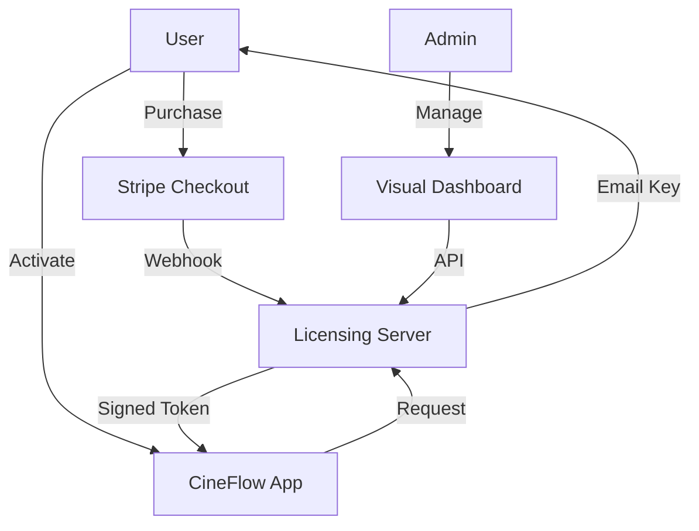

# CineFlow Licensing Ecosystem Documentation

This document provides a comprehensive overview of the licensing, distribution, and management infrastructure for the CineFlow Suite.

---

## 1. System Architecture

The ecosystem consists of three main pillars:
1.  **CineFlow Suite (Desktop App)**: Built with Tauri. Requests activation and verifies local tokens using Ed25519 signatures.
2.  **Alan Alves Studio (Website)**: The commercial hub. Handles sales (Stripe), provides downloads, and hosts the visual Admin Dashboard.
3.  **Licensing Server (Backend)**: The brain of the operation. Manages the SQLite database, generates keys, validates activations, and handles automated emails via Resend.



---

## 2. Component Breakdown

### A. Licensing Server (`/licensing-server`)
*   **Database**: SQLite (`data/database.sqlite`) stores `licenses` and `activations`.
*   **Security**: Ed25519 private key signs activation tokens.
*   **Endpoints**:
    *   `POST /webhook`: Ingests Stripe payments and triggers key delivery.
    *   `POST /activate`: Validates HWID/Email/Key and returns a signed token.
    *   `POST /resend-key`: Recovery endpoint for users who lost their key.
    *   `GET /admin/*`: Secured API for the visual dashboard.

### B. Website Integration (`web_three`)
*   **Store Page (`/#/store`)**: Displays CineFlow Suite as a premium product linked to Stripe.
*   **Download Page (`/#/download`)**: Branded, minimal portal for macOS (DMG) and Windows (EXE) downloads.
*   **Admin Dashboard (`/#/admin/licensing`)**: 
    *   Visual interface for managing the license database.
    *   Requires `ADMIN_SECRET` token for access.
    *   Allows manual key creation, activation resets, and user lookup.

### C. App Activation UI (`exposeu_wrapkit`)
*   **Location**: `src/components/ActivationScreen.tsx`
*   **Design**: 4:5 aspect ratio card, Lavender (#a592ff) accents, minimalist high-fashion aesthetic.
*   **Logic**: Captures Email and License Key, retrieves HWID via Tauri command, and stores the signed token locally.

---

## 3. Operational Guide

### Manual Key Creation
If you need to grant a license manually (e.g., for a reviewer or VIP):
1.  Open the **Visual Dashboard** at `alan-design.com/#/admin/licensing`.
2.  Enter the admin token.
3.  Use the "Create Key" field with the user's email.
4.  The system will generate a `CF-XXXX-...` key and email it automatically.

### Resetting Activations
Each license allows **2 concurrent workstations**. If a user reaches the limit:
1.  Search for the user's email in the **Visual Dashboard**.
2.  Click the **Reset (Refresh)** icon next to their key.
3.  This clears all HWID locks, allowing the user to activate on new machines.

---

## 4. Environment Configuration (`.env`)

The Licensing Server requires the following variables:

```bash
# Security
STRIPE_SECRET_KEY=sk_...
STRIPE_WEBHOOK_SECRET=whsec_...
PRIVATE_KEY_B64=... # Ed25519 Private Key
ADMIN_SECRET=...     # For Visual Dashboard access

# Delivery
RESEND_API_KEY=re_...
EMAIL_FROM=CineFlow <onboarding@resend.dev>
```

---

## 5. Distribution Roadmap

| Phase | Task | Status |
| :--- | :--- | :--- |
| **Verification** | Verify custom domain in Resend for production emails | [ ] Pending |
| **Signing** | Acquire Apple Developer ID & Windows EV Certificate | [ ] Pending |
| **Deployment** | Dockerize Licensing Server to TrueNAS | [ ] Pending |
| **Publicity** | Update Store Page links to production Stripe prices | [ ] Pending |

---
*Documented by Antigravity on 2026-05-02*
