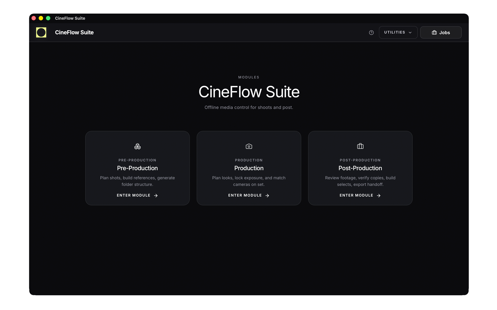

# CineFlow Suite — Support

*Web version available at: [https://noobsaibot666.github.io/wrap-preview/support.html](https://noobsaibot666.github.io/wrap-preview/support.html)*

---

## Overview

CineFlow Suite is a local-first creative toolkit designed for filmmakers, photographers, and production teams.  
All processing happens on your device. No accounts, no cloud, no subscriptions.

This page provides support information, basic troubleshooting, and contact details.

---

## Contact

For support requests, bug reports, or general inquiries:

- Email: support@cineflowsuite.com

When contacting support, please include:

- App version  
- macOS / Windows version  
- Device model (if relevant)  
- Description of the issue  
- Steps to reproduce (if applicable)  

---

## Frequently Asked Questions

### Does CineFlow require an account?
No. CineFlow runs fully offline and does not require login or registration.

---

### Does CineFlow upload or collect my data?
No. All data is processed locally on your machine. Nothing is uploaded or tracked.

---

### Where are my files stored?
All files and exports are saved locally on your device, in locations you define.

---

### Can I use CineFlow without internet?
Yes. Internet connection is not required for core functionality.

---

## Troubleshooting

### App does not start
- Restart the application  
- Restart your system  
- Reinstall the latest version  

---

### Slow performance with large media sets
- Ensure sufficient disk space is available  
- Use fast local storage (SSD recommended)  
- Close other high-load applications  

---

### Export issues
- Check destination folder permissions  
- Verify available disk space  
- Try exporting to a different location  

---

## Updates

CineFlow Suite is actively developed.  
For best performance and stability, always use the latest available version.

---

## Compatibility

### macOS
- macOS 13 or newer recommended  

### Windows
- Windows 10 / 11  

---

## Legal

CineFlow Suite operates as a local-first application.  
No personal data is collected, stored, or transmitted.

For more information, refer to the Privacy Policy.

---

## Response Time

Support requests are typically answered within 1–2 business days.